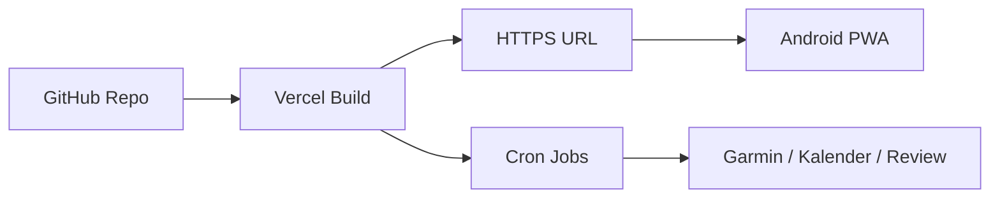

# Deployment auf Vercel

## Übersicht



## 1. GitHub Repository

Falls noch kein Git-Repo:

```bash
cd personal-os
git init
git add .
git commit -m "Initial commit: Personal OS"
```

Auf GitHub ein **neues Repository** erstellen (ohne README, wenn du dieses behalten willst):

```bash
git remote add origin https://github.com/DEIN-USER/personal-os.git
git branch -M main
git push -u origin main
```

## 2. Vercel-Projekt anlegen

1. [vercel.com](https://vercel.com) → Login mit GitHub.
2. **Add New… → Project** → Repository `personal-os` importieren.
3. Framework: **Next.js** (wird erkannt).
4. **Environment Variables** — alle aus `.env.local` übernehmen:

| Variable | Production |
|----------|------------|
| `NEXT_PUBLIC_SUPABASE_URL` | gleich wie lokal |
| `NEXT_PUBLIC_SUPABASE_ANON_KEY` | gleich wie lokal |
| `SUPABASE_SERVICE_ROLE_KEY` | gleich wie lokal |
| `GROQ_API_KEY` | gleich wie lokal |
| `CRON_SECRET` | gleicher Wert wie lokal |
| `NEXT_PUBLIC_SITE_URL` | **`https://DEIN-PROJEKT.vercel.app`** |
| `GOOGLE_CLIENT_ID` / `SECRET` | gleich |
| `GARMIN_EMAIL` / `PASSWORD` | gleich |
| `NEXT_PUBLIC_VAPID_PUBLIC_KEY` | optional |
| `VAPID_PRIVATE_KEY` | optional |

5. **Deploy** klicken.

## 3. Nach dem ersten Deploy

### Supabase Auth

**Authentication → URL Configuration**

- **Site URL**: `https://DEIN-PROJEKT.vercel.app`
- **Redirect URLs** ergänzen:
  - `https://DEIN-PROJEKT.vercel.app/callback`

### Google Cloud Console

**APIs & Services → Credentials → OAuth Client**

Unter **Authorized redirect URIs**:

```
https://DEIN-PROJEKT.vercel.app/api/auth/google/callback
```

### Garmin

Garmin-Sync läuft serverseitig auf Vercel. Bei **MFA** Tokens lokal mit `npm run garmin:login` erzeugen — auf Vercel nur Email/Passwort ohne MFA oder Tokens als Secret (fortgeschritten).

## 4. Cron Jobs

In `vercel.json` bereits konfiguriert:

| Pfad | Zeitplan | Aufgabe |
|------|----------|---------|
| `/api/calendar/sync` | alle 15 Min | Google Kalender |
| `/api/cron/garmin-sync` | täglich 06:00 UTC | Garmin + Readiness |
| `/api/cron/weekly-review` | Sonntag 20:00 UTC | Wochen-Review + KI |

Vercel sendet `Authorization: Bearer CRON_SECRET`. Variable **`CRON_SECRET`** muss in Vercel gesetzt sein.

**Hinweis:** Cron-Jobs sind auf dem **Vercel Hobby-Plan** begrenzt; für persönliche Nutzung meist ausreichend.

## 5. Custom Domain (optional)

Vercel → Project → **Settings → Domains** → z. B. `personal.example.com`.

Dann `NEXT_PUBLIC_SITE_URL` und alle OAuth-Redirects auf die neue Domain anpassen.

## 6. Android-App nach Deploy

Siehe [Android-App (PWA)](android-app) — URL in Chrome auf dem Handy öffnen und installieren.

## 7. Updates veröffentlichen

```bash
git add .
git commit -m "Beschreibung der Änderung"
git push
```

Vercel baut automatisch neu (Production Branch = `main`).

## GitHub Pages (Dokumentation)

Diese Doku unter `/docs` kann als Website dienen:

1. GitHub Repo → **Settings → Pages**
2. **Source**: Deploy from branch
3. Branch: `main`, Ordner: **`/docs`**
4. Nach 1–2 Min: `https://DEIN-USER.github.io/personal-os/`

Die App selbst läuft auf **Vercel**, nicht auf GitHub Pages.
